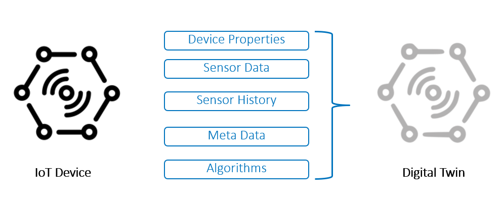

# Expanding Lua Capabilities with Modules

## Table of Contents


* [Expanding Lua Capabilities with Modules](#expanding-lua-capabilities-with-modules)
    * [Table of Contents](#table-of-contents)
    * [Introduction](#introduction)
    * [Structuring a Lua Module](#structuring-a-lua-module)
    * [Creating a Device Module](#creating-a-device-module)
    * [Summary](#summary)
    * [License](#license)
    * [Additional Resources](#additional-resources)


## Introduction

In this project we will take a look at how you can expand the capabilities of your Lua windows through the use of modules.  A module is like a library that can be loaded using the require statement and may contain any number of functions and variables.  You can use a module to simply move procedural functions out or your main code for re-use or code clarity.  However, a more powerful way to use modules is to create classes of functions that provide a behavior.   In this project we will examine a couple of new classes.   Since we want to process streaming data let's create a class that defines a device.   

## Structuring a Lua Module

Most everything in Lua is either a 

- string 
- number
- table
- function

So how do we take a table and turn it into a class that supports polymorphic properties?  We will do this by manipulating the __index metamethod.   To simplify things in my brain I just think of this as a secondary index.   Any time you define a function and attach it to a table, this function is assigned to the primary index and is called before anything that is assigned to the secondary index.  Conversely,  if you call a function that doesn't exist in the primary index the secondary index is then used.  Consider the following code snippet. 

```lua
------------------
-- Module Animal 
------------------
local M = {}  -- define a new table
local M_mt = { __index = M }
M.class = "animal"
M.sound = "grrr"
-- Create new instance of this class and return new object
function M:new( )
    local self = {}
    setmetatable( self, M_mt )  --  New object inherits from M 
    return self
end
--  delete this object 
function M:destroy()
	self = nil
    return
end
return M  -- table index returned
```

This module contains 2 functions **new** and **destroy** and are directly attached to table M.  When we call the **new** function it defines a new table, in this case called **self**, and assigns the secondary index of table **self** to be the index of table M.   **Self** inherits all the features of module M.  

I know this is all confusing but you can use this snippet of code over and over in every module you create even if you don't understand what it is doing.  The key feature here is when we call the **new** function we get an instance of this class to extend or destroy as we please.   It is not a simple procedural call to a function that is contained in a module.  

Let's show how this can be used with the classic cat / dog example.  Assuming we have a module called TTanimal.lua 

```lua
local animal = require( "TTanimal" )

local cat = animal:new()
cat.sound = "meow"   -- extend animal class with cat sounds

local dog = animal:new()
dog.sound = "bark"

cat:destroy()
dog:destroy()
```

Here we created 2 new object instances of the animal class and extend them to produce the appropriate sound.  Since cat.sound is assigned to the primary index of the table cat, this sound is found before the base class sound of "grrrr".   Any type of variable can be overwritten in this way, to extent the class to what is needed.   Once we are done with these objects we can destroy them using the destroy function that is available in the base animal class.  Any variable set to nil and therefore unreferenced is tagged as available for garbage collection.  The next time garbage collection runs these objects are deleted from memory.  

 

## Creating a Device Module

By now you must be thinking, why do I care about  animal classes?  This all can't be useful from an ESP Lua window which processes streaming data.  Consider the scenario where you have a device that contains many sensors.  You might also want to consider LAG values for each sensor.  A device class might help you better manage a digital twin representation of the physical device.  

Raw sensor data may be combined with other important metadata.  Algorithms may be created that perform actions such has,

- summary statistics 
- sensor value integrity checking 
- unit conversion 
- LAG value maintenance 
- periodic event generation

A sample strawman of a device module might look like this: 

```lua
------------------
-- Module Device
------------------
local M = {}  -- define a new table
local M_mt = { __index = M }
M.class = "device"
M.LAGdepth = 5
M.deviceID = ""
M.sensordata = {}
M.metadata = {}

-- Create new instance of this class and return new object
function M:new( )
    local self = {}
    setmetatable( self, M_mt )  --  New object inherits from M 
    return self
end
--  delete this object 
function M:destroy()
	self = nil
    return
end
function M:addmetadata(k,v)
    -- update self.metadata with incoming values by key 
    return
end
function M:addsensordata(k,v)
    -- update self.sensordata with incoming values by key 
    -- maintain self.LAGdepth 
    return
end
function M:setLAGdepth(v)
        -- maintain self.LAGdepth 
        self.LAGdepth = v
    return
end
function M:runSummaryStats()
        -- Loop through sensor data and perform summary stats 
    returns
end
function M:runDataIntegrity(k,v)
        -- Check for data integrity on incoming sensor data
        
    return
end
return M  -- table index returned
```

Using Lua persistent variables allows you to create these device objects and maintain them in state.  Creating a heartbeat function gives you the ability to perform periodic actions on the enhanced data.  Many objectives can be achieved. 


## Summary

Using this technique gives you the power to expand Lua windows using OO features and can make your programs more manageable and powerful.   Creating a well featured device class would help in creating and maintaining digital twins of devices in your environment.   Very powerful indeed.  

## License

> This project is licensed under the SAS License Agreement for Corrective Code or Additional Functionality.

## Additional Resources

* [SAS Event Stream Processing Product Documentation](https://go.documentation.sas.com/doc/en/espcdc/v_025/espcreatewindows/p0yj92wgv3ssyyn1syatsh9l1t74.htm)
* [https://www.tutorialspoint.com/lua/lua_modules.htm](https://www.tutorialspoint.com/lua/lua_modules.htm)
*  [Lua has its own pattern matching special character set](https://riptutorial.com/lua/example/20315/lua-pattern-matching)
* [Luarocks package manager](https://luarocks.org/)
